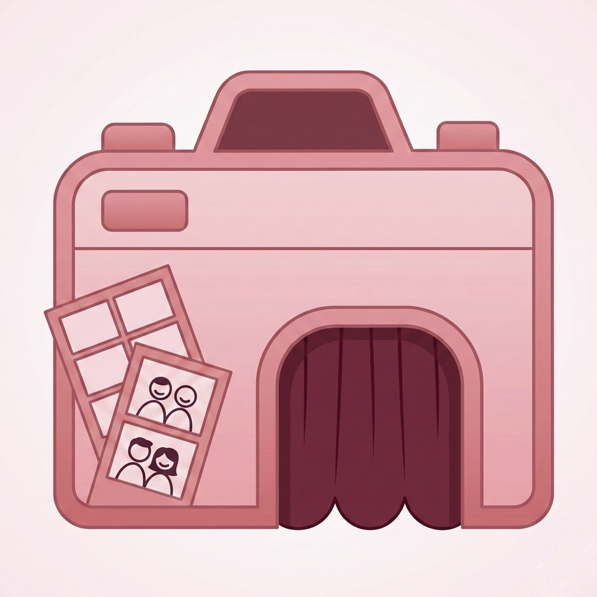

  

<h1 align="center">Unposed</h1>

<em>Real moments, not poses.</em>

  
  
  

---

## The Problem

We've all been there — someone pulls out a camera and suddenly everyone freezes into the same rehearsed smile. The "photo-ready" face. You tilt your head the right amount, eyes slightly wider, lips curled just so. The result? A technically fine photo that looks like every other photo you've ever taken.

The best photos I've seen of people — the ones that actually *feel* like them — are never posed. They're mid-laugh, mid-sentence, caught off guard. But you can't really ask someone to "act natural." That defeats the whole purpose.

So I built **Unposed**.

## What It Does

Unposed is a photobooth app that tricks you into being yourself.

You set up your strip — pick a layout, choose how many frames — and hit start. From there, the app takes over. It runs a **misdirection engine** that uses fake countdowns, false shutter sounds, surprise flashes, emoji pop-ups, and long stretches of absolutely nothing... and then captures the photo when you least expect it.

Every session picks a random **mood** (sneaky, chaotic, calm, playful, ghostly) that shapes the entire vibe — how many fakes you'll get, how long the silences are, whether the countdown is telling the truth. No two sessions feel the same. The engine even tracks what tricks it already used so it doesn't repeat itself.

The result is a photo strip of genuinely candid moments. You laughing because a countdown just lied to you. You looking confused because nothing happened for 5 seconds. You mid-blink because it caught you right after a fake flash.

  

## Features

**📸 Misdirection Engine**
The core of the app. A weighted randomization system that composes unique "beat sequences" for each frame — mixing countdowns, fake shutter sounds, haptic fakes, emoji distractions, and silent ambushes. It picks a session mood at the start and evolves throughout the capture.

**🎭 Face-Tracked Props**
Real-time face landmark detection using Vision framework. Pick from built-in props (sunglasses, hats, wigs, a joker face, a masquerade mask) and they track your face live on camera. Masks even align to your eye positions. Props show up in your final photos.

**✂️ Prop Scanner**
Want to use your own object as a prop? Point the camera at anything, snap a photo, and the app uses `VNGenerateForegroundInstanceMaskRequest` to cut it out from the background. Pick where it should anchor (eyes, forehead, nose, chin, hand) and it becomes a face-tracked prop.

**🖼 Strip Layouts**
Three layout styles:
- **Vertical** — Classic photo strip (2, 3, or 4 frames)
- **Square Grid** — 2×2, 2×3, or 2×4 grid layout (4, 6, or 8 frames)
- **Polaroid** — Single candid shot with that instant-photo feel

**🎨 Full Customization**
After capture, customize your strip before saving:
- Solid background colors or pattern backgrounds
- Custom colors via the system color picker
- Accent overlays (hearts, stars, dots, flowers, cosmic, stamps) that scatter around your photos
- Personal message, date stamp, signature
- Import your own pattern from your photo library

**🎬 Curtain Transition**
The app opens with velvet curtains that part when you enter the booth. Because if you're doing a photobooth, commit to the bit.

  
  &nbsp;&nbsp;
  
  &nbsp;&nbsp;
  

  
  &nbsp;&nbsp;
  
  &nbsp;&nbsp;
  

## Tech Stack

| What | How |
|---|---|
| UI | SwiftUI, dark theme with a soft pink palette |
| Camera | AVFoundation (`AVCaptureSession`, photo + video data output) |
| Face Tracking | Vision framework (`VNDetectFaceLandmarksRequest`) |
| Hand Detection | Vision framework (`VNDetectHumanHandPoseRequest`) |
| Subject Isolation | Vision (`VNGenerateForegroundInstanceMaskRequest`) + Core Image masking |
| Orientation | `AVCaptureDevice.RotationCoordinator` for proper device rotation handling |
| Haptics | UIKit haptic feedback engine with randomized intensity patterns |
| Export | UIGraphicsImageRenderer for high-res strip rendering |
| Persistence | Custom props saved as PNG + JSON metadata to Documents |

## How the Misdirection Works

The engine isn't just random delays. Each frame goes through a composition pipeline:

1. **Mood Selection** — A session mood is picked at the start (sneaky, chaotic, calm, playful, ghostly). This sets the weights for silence vs. fakes vs. countdowns.
2. **Type Selection** — A misdirection type is picked per frame (silent surprise, lying countdown, fake barrage, delayed nothing, instant ambush, long con, countdown abandoned, reverse expectation). Recent types are heavily penalized to avoid repetition.
3. **Beat Composition** — The type is expanded into a sequence of individual beats: countdowns, fake flashes, fake shutter sounds, haptic pulses, emoji pop-ups, silence gaps.
4. **Secondary Injection** — Extra surprise beats are layered on top for variety.
5. **Deduplication** — If the resulting sequence matches a recent one, it gets mutated.
6. **Post-Capture Decoy** — After the *real* capture, sometimes a fake flash or emoji fires to mess with you for next time.

The whole point is that you can never learn the pattern because there isn't one.

## Swift Student Challenge

This app was built as my submission for the **Swift Student Challenge**. The entire project is a Swift Playground app (`.swiftpm`) — no Xcode project, no external dependencies. Everything from the misdirection engine to the face tracking to the strip renderer is built from scratch using Apple frameworks.

## Requirements

- iOS 17.0+
- iPhone or iPad
- Camera access (it's a photobooth app, after all)

## Running It

Open `Unposed.swiftpm` in **Swift Playgrounds** on iPad or in **Xcode** on Mac. Build and run on a physical device (camera is required).

---

  Built with way too much coffee and a lot of fake shutter sounds.

